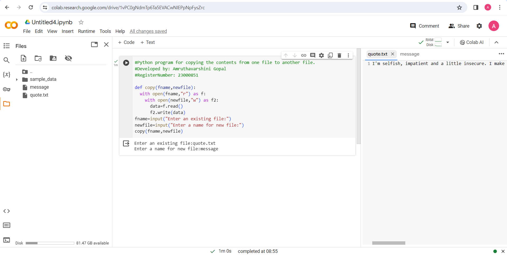
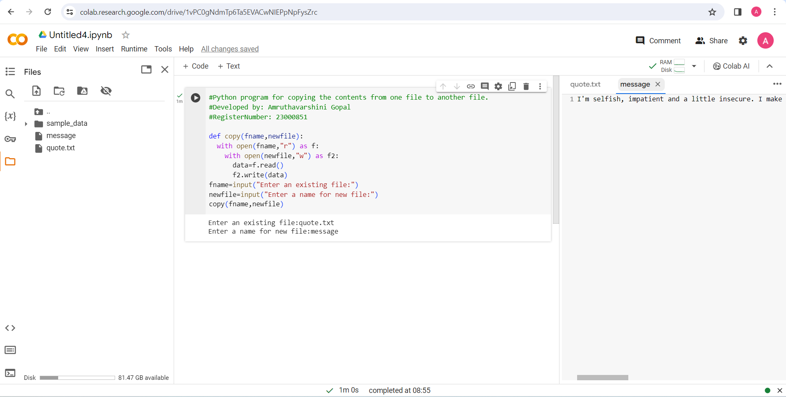

# Copy-file

## AIM:

To write a python program for copying the contents from one file to another file.

## EQUIPEMENT'S REQUIRED: 

1. PC
2. Anaconda - Python 3.7

## ALGORITHM: 

### Step 1:

Define the function as copy with arguments as existing file name and new file name

### Step 2: 

Open the existing file to read
 
### Step 3: 

Open the new file to write

### Step 4:  

Copy the contents from existing file to new file

### Step 5: 

Get the inputs from the user for existing file and new file. Call the function

### Step 6: 

End the program

## PROGRAM:
```
#Python program for copying the contents from one file to another file.
#Developed by: Amruthavarshini Gopal
#RegisterNumber: 23000851

def copy(fname,newfile):
  with open(fname,"r") as f:
    with open(newfile,"w") as f2:
      data=f.read()
      f2.write(data)
fname=input("Enter an existing file:")
newfile=input("Enter a name for new file:")
copy(fname,newfile)
```
## OUTPUT:
#Read file


#Write file


## RESULT:

Thus the program is written to copy the contents from one file to another file.